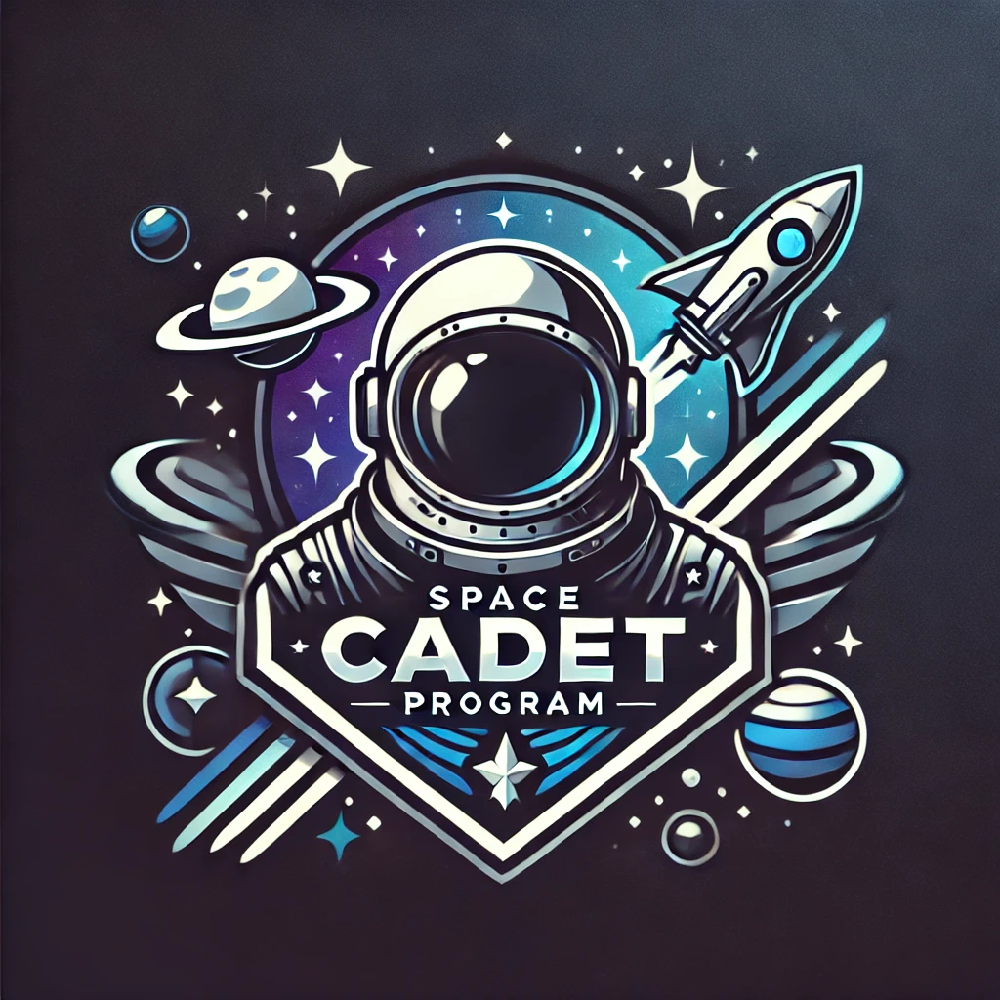
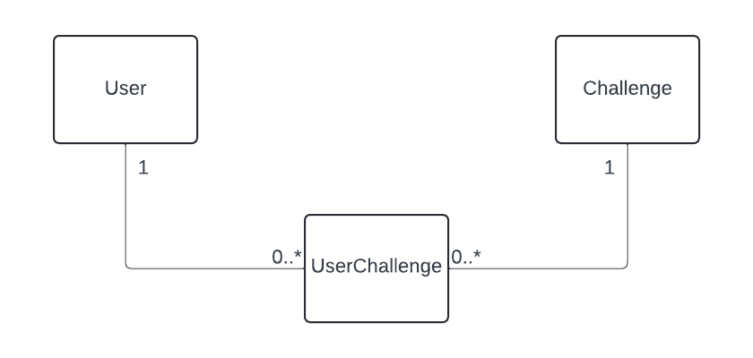

# Hack The Future 2024



Welkom aan boord, toekomstige ruimteverkenners!

Jullie zijn geselecteerd voor een van de meest spannende missies in de ruimtevaartgeschiedenis: het ontwikkelen van de Space Cadet Program app! Deze app wordt de ultieme metgezel voor cadetten die zich voorbereiden op een leven als astronaut. 🌟

Wat gaat jullie app doen? De Space Cadet Program app is ontworpen om de voortgang van onze cadetten te volgen tijdens hun spannende reis door de ruimteopleiding. Cadetten moeten een reeks uitdagende missies en oefeningen voltooien om hun vaardigheden te testen en te verbeteren. Alleen de meest getalenteerde en doorzettende cadetten zullen uiteindelijk geselecteerd worden om astronaut te worden.

## Starter Project

Voor deze opdrachten werken jullie in SolidStart. De technologiekeuze is vrij, maar om jullie op weg te
zetten, bevat deze repository een starter project in [SolidStart](https://start.solidjs.com/). Je start deze als volgt:

```
npm run drizzle:migrate
npx tsx drizzle/seed.ts
npm run dev
```

## Domeinmodel



## Challenge

Om de verschillende teams op een gelijkaardige manier te kunnen beoordelen, verwachten we ongeveer deze functionaliteiten:

- Cadetten moeten een duidelijk overzicht kunnen zien van alle uitdagingen, met onderscheid tussen voltooide en nog te volbrengen uitdagingen
- Cadetten moeten gemakkelijk uitdagingen kunnen doorzoeken op naam
- Cadetten moeten de mogelijkheid hebben om informatie over elke uitdaging te bekijken en deze vervolgens te volbrengen
- Cadetten moeten toegang hebben tot een leaderboard dat de huidige scores toont van alle cadetten, per uitdaging, zodat ze hun voortgang kunnen vergelijken met die van anderen

## Uitbreidingen

Hieronder vind je enkele uitbreidingen als suggestie of laat je eigen creativiteit de vrij loop gaan!

- Cadetten moeten kunnen inloggen via externe providers zoals Google of Microsoft, waardoor ze eenvoudig en veilig toegang krijgen tot het systeem

## Beoordeling

Op het einde van de hackathon, beoordeelt onze jury het eind resultaat. In deze beoordeling houden we de volgende zaken:

- Functionaliteit (30%)

  - Werkt de applicatie zoals verwacht? (geen crashes of bugs)
  - Werken alle functionaliteiten soepel zoals we dit van een echte applicatie zou verwachten?
  - Hoe dicht zitten we bij een eerste MVP om dit effectief te gebruiken?

- Creativiteit & innovatie (40%)

  - Introduceert de applicatie nieuwe, innovative of creatieve oplossingen?
  - Hoe springt jullie applciatie er bovenuit tov de andere deelnemers

- User experience (25%)

  - Is de user interface intuitief en gebruiksvriendelijk?
  - Ziet de applicatie er visueel aantrekkelijk uit?
  - Is de functionaliteit duidelijk voor nieuwe gebruikers?
  - Heeft het team een duidelijke en complete presentatie gegeven van hun applicatie?

- Performance (5%)
  - Is de applicatie performant en bruikbaar?
  - Maakt de applicatie effectient gebruik van de data en andere resources
